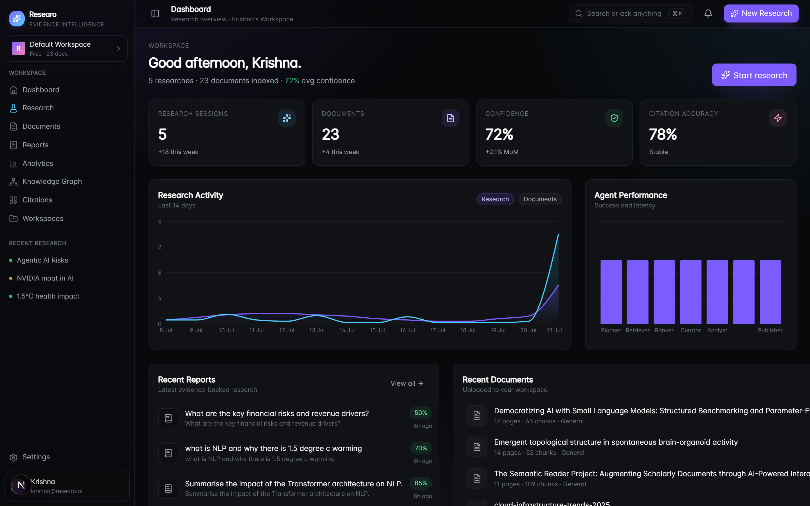
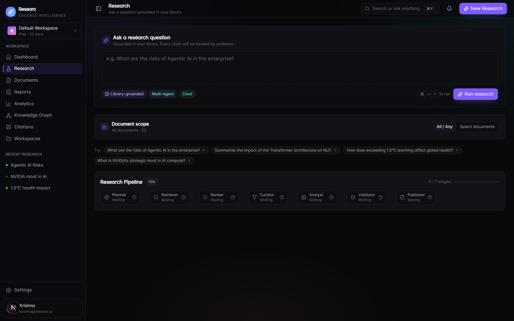
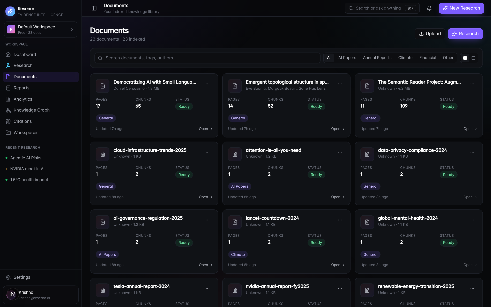
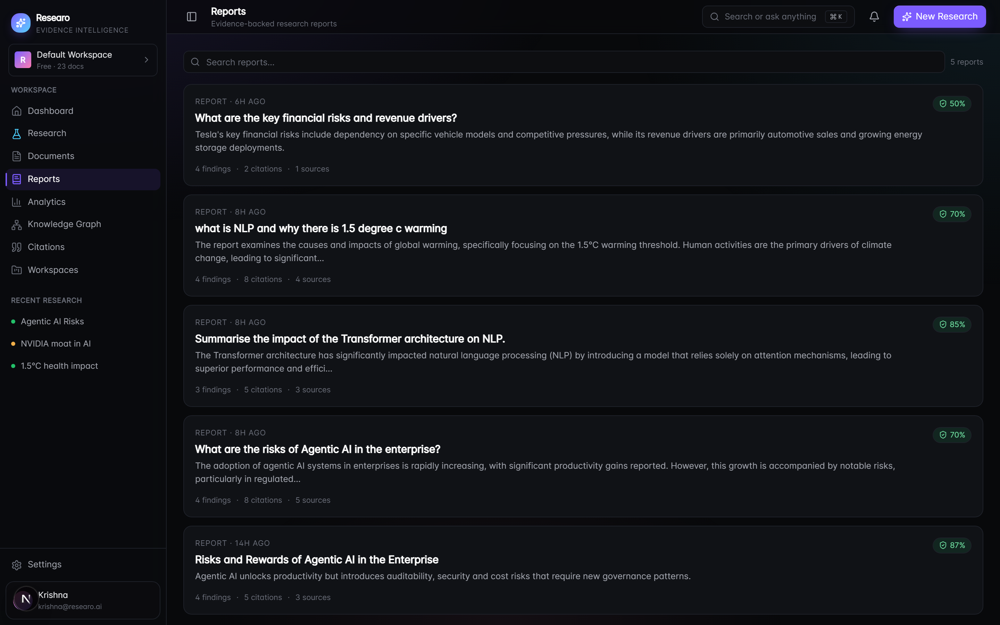
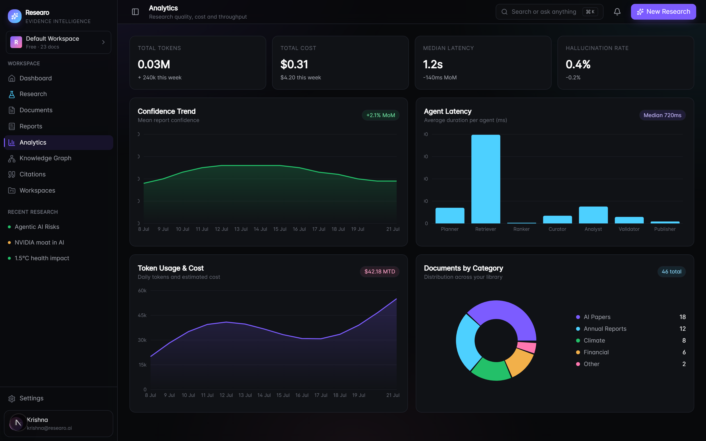
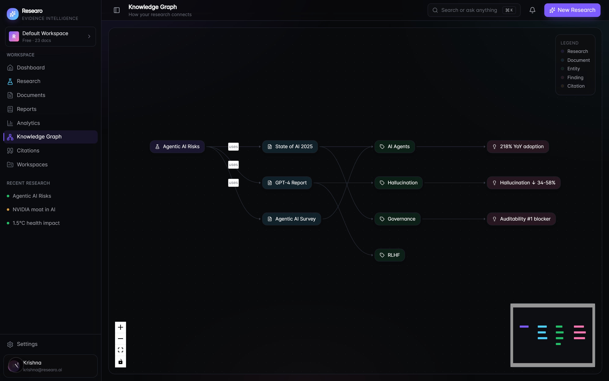
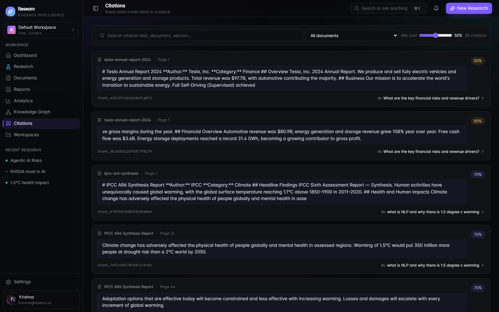
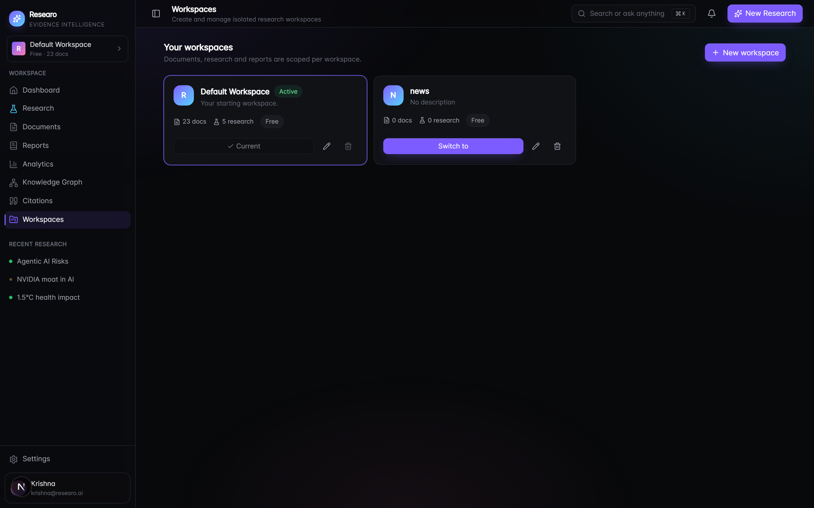
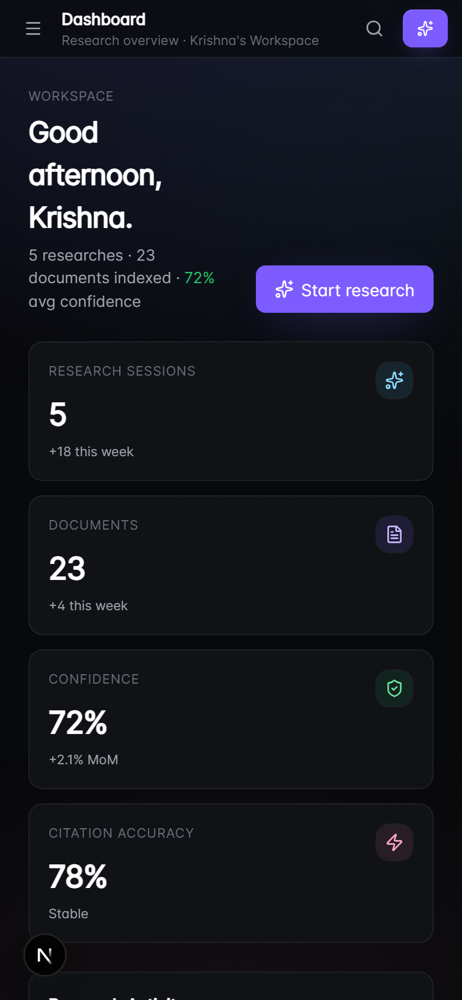

<!-- ========================================================= -->
<!--                       HERO SECTION                         -->
<!-- ========================================================= -->

<div align="center">

# 🔬 Researo

### **Evidence-First AI Research Intelligence Platform**

**Transform unstructured documents into trusted, evidence-backed research using a multi-agent AI system.**

<p align="center">


</p>

---

[](#)
[]
[]
[]
[]
[]
[]
[]

---

### 🚀 Live Demo

**🌐 Live Application**

> https://YOUR-RAILWAY-URL.up.railway.app

---

### 🎥 Demo Video

> https://github.com/user-attachments/assets/91f611a7-0ba5-4f2a-9cc1-d88330a227e9


---


### 💻 Source Code

> https://github.com/Krishnakant73/Researo.git

</div>

---

# 🏆 AI Challenge Submission

## Theme

**AI Research Agent**

Researo is built as an autonomous **AI Research Intelligence Platform** that transforms thousands of unstructured documents into trusted, evidence-backed research reports using a **multi-agent AI workflow**.

Unlike traditional AI chatbots that generate answers from a single prompt, Researo performs **planning, retrieval, reasoning, validation, and citation generation** before presenting the final response.

---

# ❗ Problem Statement

Today, researchers, students, startups, enterprises, and analysts spend countless hours searching through:

- 📄 PDFs
- 📚 Research Papers
- 📊 Annual Reports
- 📑 Technical Documentation
- 📖 Policies
- 📈 Financial Reports

Current AI assistants often:

❌ Hallucinate facts

❌ Don't provide trustworthy citations

❌ Can't analyze large document collections effectively

❌ Lose context across multiple files

❌ Cannot explain where an answer came from

This creates a major trust problem for anyone making important decisions based on AI-generated information.

---

# 💡 Our Solution

## Researo

An **Evidence-First AI Research Intelligence Platform**

Instead of asking one LLM to generate an answer...

Researo orchestrates a **Multi-Agent AI Pipeline** that:

📥 Understands the research goal

↓

📚 Searches across uploaded documents

↓

🧠 Retrieves the most relevant evidence

↓

📊 Ranks information by relevance

↓

🔍 Validates findings

↓

📑 Generates citations

↓

📄 Produces a structured research report

Every important claim is backed by real document evidence, making AI outputs significantly more transparent and trustworthy.

---

# ✨ Why Researo?

✅ Evidence-backed AI research

✅ Multi-Agent Architecture

✅ Hybrid Search (Semantic + BM25)

✅ Citation-first reports

✅ Workspace-based knowledge management

✅ Interactive Knowledge Graph

✅ AI-powered analytics dashboard

✅ Modern SaaS experience

✅ Production-ready architecture

---

# 🎯 Key Innovation

Researo is **not another AI chatbot.**

It behaves like an **AI Research Team**.

Instead of relying on a single prompt, multiple specialized AI agents collaborate together:

- 🧠 Planner
- 🔎 Retriever
- 📊 Ranker
- 📂 Curator
- 🤖 Analyst
- ✅ Validator
- 📄 Publisher

Each agent has a dedicated responsibility, making the final report more accurate, explainable, and reliable.

---

# 🌟 Vision

Our vision is to build the future operating system for AI-powered research.

Whether you're analyzing:

- Academic papers
- Business reports
- Company filings
- Technical documentation
- Climate reports
- Healthcare research
- Government policies

Researo enables users to move from **information overload** to **trusted insights** within minutes.

---

> **"Don't just ask AI. Ask AI that can prove its answers."**
<!-- ========================================================= -->
<!--                     CORE FEATURES                          -->
<!-- ========================================================= -->

# ✨ Core Features

Researo is designed as a complete **AI Research Intelligence Platform**, not just a chatbot.

Every feature is built around one goal:

> **Deliver trustworthy, evidence-backed research instead of AI-generated guesses.**

---

# 🚀 What Makes Researo Different?

| Traditional AI Chatbots | 🔬 Researo |
|--------------------------|------------|
| Single Prompt | Multi-Agent Research Pipeline |
| Generic Answers | Evidence-backed Reports |
| Hallucinated Information | Citation Verified Findings |
| No Source Tracking | Clickable Source References |
| Limited Context | Multi-Document Intelligence |
| One Conversation | Research Workspace |
| Static Output | Interactive Research Dashboard |

---

# 🧠 Multi-Agent AI Pipeline

Unlike traditional AI assistants, Researo divides the research process into specialized AI agents.

```text
                User Question
                      │
                      ▼
              🧠 Planner Agent
                      │
                      ▼
            🔍 Retriever Agent
                      │
                      ▼
             📊 Ranker Agent
                      │
                      ▼
            📂 Curator Agent
                      │
                      ▼
             🤖 Analyst Agent
                      │
                      ▼
            ✅ Validator Agent
                      │
                      ▼
            📄 Publisher Agent
                      │
                      ▼
          Evidence-backed Research Report
```

Each AI agent has a single responsibility, making the final output more reliable, explainable, and scalable.

---

# 🔄 End-to-End Research Workflow

```text
Upload Documents
        │
        ▼
Document Parsing
        │
        ▼
Chunking
        │
        ▼
Embedding Generation
        │
        ▼
Vector Database
        │
        ▼
Hybrid Retrieval
        │
        ▼
Multi-Agent Analysis
        │
        ▼
Citation Validation
        │
        ▼
Research Report
```

Everything happens automatically.

---

# 📄 Smart Document Processing

Researo automatically processes uploaded documents.

Supported formats (verified in `apps/api/app/parsing/pdf.py`):

| Format | Extensions | Parser |
|--------|-----------|--------|
| PDF | `.pdf` | PyMuPDF, with a pdfplumber fallback |
| Word | `.docx` | Built-in OOXML reader |
| Excel | `.xlsx` | openpyxl (one sheet → one page) |
| Delimited | `.csv`, `.tsv` | Rendered as `col: value` lines |
| Text / Markup | `.txt`, `.md`, `.markdown`, `.log`, `.json` | UTF-8 text |

> **Notes:**
> - Legacy **`.xls`** (old binary Excel) is **not** supported — convert to
>   `.xlsx` or `.csv` first. (`openpyxl` only reads `.xlsx`.)
> - Other file types (e.g. `.xml`) are read as **plain UTF-8 text** on a
>   best-effort basis.
> - Scanned/image-only PDFs yield no text (no OCR in the request path) and are
>   marked `failed`.

For every document Researo:

✅ Extracts text

✅ Detects metadata

✅ Splits into semantic chunks

✅ Generates embeddings

✅ Stores vectors

✅ Makes content searchable

---

# 🔍 Hybrid Search Engine

Instead of relying only on vector search, Researo combines multiple retrieval techniques.

### Semantic Search

Finds documents by meaning.

### Keyword Search (BM25)

Finds exact keyword matches.

### Reciprocal Rank Fusion

Combines both retrieval methods into a single ranked result.

This produces much higher quality evidence retrieval than using vectors alone.

---

# 📑 Evidence-First Reports

Every generated report includes:

- Executive Summary
- Key Findings
- Supporting Evidence
- Clickable Citations
- Confidence Score
- Contradictions
- Recommendations
- Follow-up Questions

No unsupported claims.

Every important insight is backed by document evidence.

---

# 📚 Citation Intelligence

Every citation contains:

- Source Document
- Page Number
- Chunk Reference
- Confidence Score

Users can instantly verify where every answer originated.

---

# 🕸 Knowledge Graph

Researo automatically builds an interactive knowledge graph connecting:

```text
Research

↓

Findings

↓

Evidence

↓

Documents

↓

Topics
```

Helping users discover hidden relationships across large document collections.

---

# 📊 Analytics Dashboard

The dashboard provides real-time insights including:

- Research Activity
- AI Agent Performance
- Confidence Trends
- Token Usage
- Estimated AI Cost
- Research History
- Document Statistics
- Category Distribution

Everything updates dynamically from live backend data.

---

# 📂 Workspace Management

Research can be organized into isolated workspaces.

Each workspace contains its own:

- Documents
- Reports
- Analytics
- Research History
- Knowledge Graph

Perfect for managing multiple projects independently.

---

# ⚡ OpenRouter AI Gateway

Instead of depending on a single AI model, Researo routes requests through **OpenRouter**.

This enables support for multiple frontier models including:

- OpenAI
- Anthropic Claude
- Google Gemini
- DeepSeek
- Qwen
- Mistral
- Meta Llama

The system can intelligently switch models depending on task complexity.

---

# 🎯 AI Models Used

| Task | AI Model |
|--------|----------|
| Planning | OpenRouter |
| Retrieval Analysis | OpenRouter |
| Reasoning | OpenRouter |
| Validation | OpenRouter |
| Report Generation | OpenRouter |

The architecture is provider-agnostic, making future upgrades seamless.

---


# 🔥 Why This Matters

Instead of asking:

> "What does AI think?"

Researo answers:

> **"Here is the evidence, here is the reasoning, and here are the exact sources."**

This transforms AI from a text generator into a trusted research assistant.

---

# 🎥 Demo Video &amp; Walkthrough

A full walkthrough of the dashboard, document upload, and a live research run.


# 📸 Product Preview

| Dashboard | Research |
|------------|----------|
|  |  |

| Documents | Reports |
|------------|----------|
|  |  |

| Analytics | Knowledge Graph |
|------------|-----------------|
|  |  |

| Citations | Workspaces |
|------------|-----------|
|  |  |

| Mobile (responsive) | |
|---------------------|--|
|  | |

---

## 🌟 Built for the Future

Researo is not just a competition prototype.

It is designed as the foundation for an **Enterprise AI Research Operating System**, capable of evolving into a platform for researchers, enterprises, legal teams, healthcare organizations, financial analysts, and knowledge workers worldwide.

<!-- ========================================================= -->
<!--                  SYSTEM ARCHITECTURE                       -->
<!-- ========================================================= -->

# 🏗️ System Architecture

Researo is built using a modern, modular, AI-native architecture designed for scalability, maintainability, and future enterprise adoption.

```text
                              👤 User
                                 │
                                 ▼
                    ┌─────────────────────────┐
                    │     Next.js Dashboard    │
                    │      (Frontend UI)       │
                    └────────────┬────────────┘
                                 │
                           REST API
                                 │
                                 ▼
                    ┌─────────────────────────┐
                    │       FastAPI API       │
                    │     Business Layer      │
                    └────────────┬────────────┘
                                 │
         ┌───────────────────────┼────────────────────────┐
         ▼                       ▼                        ▼
   PostgreSQL              ChromaDB               OpenRouter
  Application DB          Vector Database         AI Gateway
         │                       │                        │
         └──────────────┬────────┴───────────────┐
                        ▼                        ▼
                LangGraph Engine          AI Providers
                        │            ┌────────────┬─────────────┐
                        ▼            ▼            ▼             ▼
                  Multi-Agent      GPT        Claude        Gemini
```

---

# 🧠 AI Agent Architecture

Instead of relying on a single LLM prompt, Researo orchestrates multiple specialized AI agents.

```text
                  User Question
                        │
                        ▼
                 🧠 Planner Agent
                        │
                        ▼
               🔎 Retriever Agent
                        │
                        ▼
                📊 Ranker Agent
                        │
                        ▼
               📂 Curator Agent
                        │
                        ▼
                🤖 Analyst Agent
                        │
                        ▼
               ✅ Validator Agent
                        │
                        ▼
               📄 Publisher Agent
                        │
                        ▼
             Final Research Report
```

Each agent has a dedicated responsibility, resulting in better reasoning, higher transparency, and reduced hallucinations.

---

# 🔄 Research Execution Flow

```text
User Uploads Documents
          │
          ▼
Document Parsing
          │
          ▼
Chunk Generation
          │
          ▼
Embedding Generation
          │
          ▼
Vector Storage
          │
          ▼
Research Question
          │
          ▼
Hybrid Retrieval
          │
          ▼
Multi-Agent Analysis
          │
          ▼
Citation Validation
          │
          ▼
Evidence-backed Report
```

---

# 🧩 Technology Stack

## Frontend

| Technology | Purpose |
|------------|---------|
| Next.js 15 | Application Framework |
| React 19 | UI Library |
| TypeScript | Type Safety |
| Tailwind CSS v4 | Styling |
| shadcn/ui | UI Components |
| Framer Motion | Animations |
| Zustand | State Management |
| TanStack Query | API Caching |
| TanStack Table | Data Tables |
| React Flow | Knowledge Graph |
| Recharts | Analytics Dashboard |
| React Markdown | Report Rendering |
| Sonner | Toast Notifications |

---

## Backend

| Technology | Purpose |
|------------|---------|
| FastAPI | REST API |
| SQLAlchemy (async) | ORM |
| SQLite / PostgreSQL | Relational store (SQLite by default, Postgres via asyncpg) |
| ChromaDB | Vector store (default, behind a `VectorStore` interface) |
| NumPy store | Zero-dependency vector fallback (same interface) |
| rank-bm25 | Lexical retrieval |
| LangGraph | Multi-Agent Workflow |
| OpenRouter | Unified AI Gateway (httpx REST) |
| PyMuPDF / pdfplumber | PDF Parsing |
| openpyxl | Spreadsheet Parsing |

---

# 🤖 AI Stack

| Component | Technology |
|-----------|------------|
| AI Gateway | OpenRouter (with a deterministic offline fallback) |
| Agent Framework | LangGraph |
| Embeddings | `BAAI/bge-small-en-v1.5` (sentence-transformers) |
| Reranker | `cross-encoder/ms-marco-MiniLM-L-6-v2` (graceful heuristic fallback) |
| Token counting | tiktoken |
| Vector Store | ChromaDB (pluggable) + BM25 hybrid, RRF fusion |
| Prompt Engineering | Custom Prompt Library |
| Research Engine | Multi-Agent Workflow |

> Embedding model, reranker toggle and retrieval Top-K values are editable at
> runtime from the in-app **Settings → AI & Models** page (persisted server-side)
> and consumed by the pipeline on the next run.

---

# 📂 Project Structure

```text
Researo/
│
├── apps/
│   ├── web/                     # Next.js 15 frontend
│   │   ├── Dockerfile
│   │   ├── railway.json
│   │   ├── next.config.ts       # output: "standalone"
│   │   └── src/
│   │       ├── app/(app)/       # routes: dashboard, research, search, documents,
│   │       │                    #         reports, analytics, graph, citations,
│   │       │                    #         workspaces, settings
│   │       ├── components/      # shell, dashboard, documents, reports, search, ui
│   │       └── lib/
│   │           ├── api.ts       # fetch client + {success,data,error} envelope
│   │           ├── types.ts
│   │           └── hooks/       # use-documents, use-research, use-search, use-settings…
│   │
│   └── api/                     # FastAPI backend
│       ├── Dockerfile
│       ├── railway.json
│       ├── requirements.txt / requirements-optional.txt
│       └── app/
│           ├── agents/          # LangGraph pipeline, prompts, schemas
│           ├── api/v1/          # documents, research, reports, search, analytics,
│           │                    # settings, workspaces, health
│           ├── services/        # document / research / analytics / settings services
│           ├── repositories/    # DB access
│           ├── parsing/         # PDF/DOCX/XLSX/CSV/text parsing + chunking
│           ├── retrieval/       # embeddings, numpy vector store, hybrid search, reranker
│           ├── models/          # SQLAlchemy models
│           └── gateway/         # OpenRouter LLM gateway
│
├── Sample_data/                 # example documents to try (see "Hands-On" below)
├── docs/screenshots/            # UI screenshots used in this README
├── gif/                         # demo media
│   ├── Dashboard.mp4            #   dashboard walkthrough
│   └── Evidence-First AI Research.gif
└── README.md
```

---

# 🔍 Hybrid Retrieval Pipeline

Traditional RAG relies only on vector similarity.

Researo combines multiple retrieval strategies.

```text
User Question
       │
       ▼
Query Expansion
       │
       ▼
Semantic Search
       │
       ├────────────┐
       ▼            ▼
Dense Search      BM25 Search
       │            │
       └──────┬─────┘
              ▼
 Reciprocal Rank Fusion
              ▼
     Ranked Evidence
              ▼
      AI Research Agents
```

This significantly improves retrieval quality while reducing irrelevant context.

---

# 🗄 Data Flow

```text
Upload File
      │
      ▼
Extract Text
      │
      ▼
Chunk Document
      │
      ▼
Generate Embeddings
      │
      ▼
Store in ChromaDB
      │
      ▼
Index Metadata
      │
      ▼
Ready for Research
```

---

# ☁ Deployment Architecture

The entire prototype is deployed using Railway.

```text
                 Railway Cloud

      ┌──────────────────────────────┐
      │        Next.js Frontend      │
      └──────────────┬───────────────┘
                     │
      ┌──────────────▼───────────────┐
      │        FastAPI Backend       │
      └──────────────┬───────────────┘
                     │
        ┌────────────┼─────────────┐
        ▼            ▼             ▼
 PostgreSQL      ChromaDB     OpenRouter API
```

Deployment Platform:

- 🚄 Railway

Future Production Stack:

- Vercel
- Cloudflare
- Qdrant
- Redis
- Kubernetes

---

# 🌐 API Design

The backend follows a REST-first architecture.

Example endpoints:

```http
GET     /api/v1/health                      # liveness probe (Railway healthcheck)
GET     /api/v1/status                      # LLM / embeddings / vector-store status

POST    /api/v1/documents/upload            # upload + parse + chunk + embed + index
GET     /api/v1/documents                   # list documents (workspace-scoped)
GET     /api/v1/documents/{id}/chunks       # indexed chunks for a document
GET     /api/v1/documents/{id}/download     # stream the original uploaded file
POST    /api/v1/documents/{id}/reindex      # re-parse / re-embed into the vector index
DELETE  /api/v1/documents/{id}

POST    /api/v1/research/query              # run the multi-agent research pipeline
GET     /api/v1/reports                     # list generated reports
GET     /api/v1/reports/{id}

POST    /api/v1/search                      # hybrid semantic + BM25 search
GET     /api/v1/analytics/dashboard         # KPIs, activity, agent performance
GET     /api/v1/workspaces                  # workspace management

GET     /api/v1/settings                    # runtime AI/retrieval settings
PUT     /api/v1/settings                    # update runtime settings

GET     /api/v1/users/me                    # current (local) user
GET     /api/v1/projects                    # list projects
POST    /api/v1/projects                    # create a project
POST    /api/v1/reports/{id}/exports        # log a report export/share (audit)
DELETE  /api/v1/workspace/{id}              # delete a workspace (cascades vectors + records)
```

Requests are scoped to the active workspace via the `X-Workspace-Id` header.
Every endpoint returns a standardized `{ success, data, error }` JSON envelope.

---

# 📦 Open Source Libraries

Researo is built on top of mature open-source technologies.

### AI

- LangGraph
- LangChain
- Transformers
- Sentence Transformers

### Frontend

- shadcn/ui
- React Flow
- Recharts
- Framer Motion
- TanStack Query
- Zustand

### Backend

- FastAPI
- SQLAlchemy (async)
- Pydantic
- PyMuPDF / pdfplumber
- openpyxl
- NumPy + rank-bm25 (hybrid retrieval)

### AI Models

- GPT
- Claude
- Gemini
- DeepSeek
- Qwen

via **OpenRouter**.

---

# ⚡ Performance Optimizations

✔ Modular Architecture

✔ Hybrid Search

✔ Multi-Agent Reasoning

✔ Efficient Chunking

✔ Context Compression

✔ Structured Outputs

✔ Lazy UI Rendering

✔ Type-safe APIs

✔ Reusable Components

✔ Production-ready Folder Structure

---

# 🚀 Designed for Scale

Although this project is submitted as a competition prototype, the architecture is designed to evolve into an enterprise-grade AI platform capable of supporting:

- Multi-tenant Workspaces
- Team Collaboration
- Enterprise Knowledge Bases
- AI Research Automation
- Legal Document Analysis
- Financial Intelligence
- Scientific Literature Review
- Healthcare Research
- Policy Intelligence
- Organization-wide Knowledge Management

---

> **"Architecture is not just about making software work today. It's about making it ready for tomorrow."**
<!-- ========================================================= -->
<!--              INSTALLATION & GETTING STARTED               -->
<!-- ========================================================= -->

# 🚀 Getting Started

Get Researo running locally in just a few minutes.

---

# 📋 Prerequisites

Before starting, ensure you have:

| Software | Version |
|----------|---------|
| Node.js | 20+ |
| Python | 3.11+ |
| Git | Latest |
| PostgreSQL | 15+ (Optional) |
| OpenRouter API Key | Recommended |

---

# 📦 Clone Repository

```bash
git clone https://github.com/Krishnakant73/Researo.git

cd Researo
```

---

# ⚙ Backend Setup

```bash
cd apps/api

python -m venv .venv

# Windows
.venv\Scripts\activate

# Linux / macOS
source .venv/bin/activate

pip install -r requirements.txt
```

Create your environment file.

```bash
cp .env.example .env
```

> (Optional but recommended) install real local embeddings + reranker + token
> counting: `pip install -r requirements-optional.txt`

Start backend. Database tables are created automatically on first boot (no
manual migration step needed), and a small sample library is seeded.

```bash
uvicorn app.main:app --reload
```

Backend running at

```
http://localhost:8000
```

---

# 💻 Frontend Setup

```bash
cd apps/web

npm install

npm run dev
```

Frontend

```
http://localhost:3000
```

---

# 🔑 Environment Variables

## Backend (.env)

```env
OPENROUTER_API_KEY=

DATABASE_URL=sqlite+aiosqlite:///./data/researo.db

CHROMA_PERSIST_DIR=./chroma_store

EMBEDDING_MODEL=BAAI/bge-small-en-v1.5

USE_LOCAL_EMBEDDINGS=true

UPLOAD_DIR=./uploads
```

> See **Configuration** below for the full list of environment variables.

---

## Frontend (.env.local)

```env
NEXT_PUBLIC_API_URL=http://localhost:8000
```

---

# 🤖 OpenRouter Configuration

Create an API key from

```
https://openrouter.ai/
```

Add

```env
OPENROUTER_API_KEY=your_key_here
```

The application automatically routes AI requests through OpenRouter.

Supported providers include:

- GPT
- Claude
- Gemini
- DeepSeek
- Qwen
- Mistral

---

# 📂 Demo Dataset

The repository ships ready-to-use examples in **`Sample_data/`**: five research
PDFs, World Bank datasets (CSV / XLS / XML), and category briefs under
`Sample_data/demo-data/`:

```
Sample_data/
├── *.pdf                    # 5 arXiv research papers
├── API_IT.NET.USER.ZS.../   # CSV — internet users (%)
├── API_SI.POV.DDAY....xls   # legacy .xls (convert to .xlsx/.csv)
├── API_SE.PRM.CMPT.FE.../   # XML — female primary completion
└── demo-data/
    ├── AI/  Climate/  Finance/
    └── Healthcare/  Legal/  Technology/
```

Upload these on the **Documents** page, then ask questions. See the full
**Hands-On** walkthrough and the tailored example questions near the end of this
README.

Example:

> Compare the strategic priorities in NVIDIA's and Tesla's latest annual reports.

> How does a planning-phase prompt-injection attack compromise a multi-agent LLM system?

> What does the evidence say about the health impacts of climate change?

---

# 🎮 How to Use

## Step 1

Open Dashboard

```
http://localhost:3000
```

---

## Step 2

Create or select a workspace.

---

## Step 3

Upload one or multiple documents.

Supported formats

- PDF

- DOCX

- TXT

- CSV

- XLSX

---

## Step 4

Wait for indexing.

Pipeline

```
Upload

↓

Parse

↓

Chunk

↓

Generate Embeddings

↓

Store Vectors

↓

Ready
```

---

## Step 5

Ask a research question.

Example

```
How has NVIDIA expanded its AI business over the last three years?
```

---

## Step 6

Watch the AI Pipeline execute live.

```
Planner

↓

Retriever

↓

Ranker

↓

Curator

↓

Analyst

↓

Validator

↓

Publisher
```

---

## Step 7

Receive a complete research report with

- Summary

- Findings

- Citations

- Evidence

- Confidence Score

---

# 📡 API Health Check

```
GET

/api/v1/health
```

Expected

```json
{
  "success": true
}
```

---

# 🧪 Testing

Frontend

```bash
cd apps/web

npm run lint

npm run typecheck

npm run test

npm run e2e
```

Backend

```bash
cd apps/api

pytest
```

# 📈 Example Questions

## AI Research

```
Compare GPT-4 and Claude.
```

---

## Finance

```
Summarize Apple's annual report.
```

---

## Healthcare

```
What are the latest WHO recommendations?
```

---

## Climate

```
Summarize the IPCC findings.
```

---

## Legal

```
What are the major policy changes?
```

---

# 🔍 Expected Workflow

```text
Upload Documents

↓

Document Processing

↓

Embedding Generation

↓

Vector Search

↓

Hybrid Retrieval

↓

AI Agent Pipeline

↓

Evidence Validation

↓

Research Report
```

---

# 💡 Tips

✔ Upload multiple documents

✔ Ask complex research questions

✔ Explore the Knowledge Graph

✔ Open Citation Explorer

✔ View Analytics Dashboard

✔ Compare reports across documents

---

# 🛠 Troubleshooting

## Embeddings not generating

Embeddings run **locally** (sentence-transformers), independent of OpenRouter.
Install the optional deps so the real model is used:

```
pip install -r requirements-optional.txt
```

Without them the app falls back to a lower-quality hash embedding. Check
`GET /api/v1/status` to see the active `embeddings.backend`. `OPENROUTER_API_KEY`
only affects LLM answer generation, not embeddings.

---

## Backend not connecting

Verify

```
NEXT_PUBLIC_API_URL
```

---

## PostgreSQL connection issue

Verify

```
DATABASE_URL
```

---

## Slow first request

The embedding model downloads during the first execution.

Subsequent requests are significantly faster.

---

# 📞 Need Help?

Open an issue on GitHub.

```
https://github.com/Krishnakant73/Researo/issues
```

We welcome feedback, feature requests, and contributions.

---

> **"Upload documents. Ask questions. Trust the evidence."** 🔬
<!-- ========================================================= -->
<!--               WHY RESEARO? | ROADMAP | CREDITS            -->
<!-- ========================================================= -->

# 🏆 Why Researo?

Today's AI can generate answers.

**Researo generates trusted research.**

Most AI assistants stop after producing text.

Researo continues by answering three critical questions:

✅ **Where did this answer come from?**

✅ **Can I verify it?**

✅ **Should I trust it?**

By combining Hybrid Retrieval, Multi-Agent AI, Citation Intelligence, and Evidence Validation, Researo transforms AI from a text generator into a reliable research assistant.

---

# 💥 What Makes Researo Unique?

Unlike traditional AI tools, Researo focuses on **trust, transparency, and explainability.**

## 🧠 Multi-Agent Intelligence

Instead of one large prompt...

Researo coordinates multiple AI agents that collaborate like a real research team.

- 🧠 Planner
- 🔍 Retriever
- 📊 Ranker
- 📂 Curator
- 🤖 Analyst
- ✅ Validator
- 📄 Publisher

---

## 📚 Evidence-First AI

Every important claim includes:

- Source Document
- Page Number
- Citation
- Confidence Score

No unsupported answers.

---

## 🔍 Hybrid Retrieval

Instead of using only Vector Search,

Researo combines:

- Semantic Search
- BM25
- Reciprocal Rank Fusion

to improve retrieval quality.

---


# 🚀 Innovation Highlights

✅ Multi-Agent AI Workflow

✅ Evidence-backed Research

✅ Citation Intelligence

✅ Hybrid Retrieval Engine

✅ Workspace-based Knowledge Management

✅ Interactive Knowledge Graph

✅ OpenRouter AI Gateway

✅ Production-inspired SaaS UI

✅ Modular AI Architecture

---

# ⚙️ Engineering Highlights

## Frontend

- Next.js 15
- React 19
- TypeScript
- Tailwind CSS v4
- shadcn/ui
- React Flow
- Recharts

---

## Backend

- FastAPI
- SQLAlchemy
- PostgreSQL
- ChromaDB
- LangGraph
- LangChain

---

## AI

- OpenRouter
- GPT
- Claude
- Gemini
- DeepSeek
- BGE Embeddings

---

# 📊 Current Prototype Features

| Feature | Status |
|----------|:------:|
| Dashboard | ✅ |
| Research Workspace | ✅ |
| Document Upload | ✅ |
| PDF Parsing | ✅ |
| Embeddings | ✅ |
| Vector Search | ✅ |
| Hybrid Retrieval | ✅ |
| Multi-Agent Pipeline | ✅ |
| Reports | ✅ |
| Citations | ✅ |
| Knowledge Graph | ✅ |
| Analytics | ✅ |
| Railway Deployment | ✅ |

---

# 🎯 Future Roadmap

## Phase 1

- Team Collaboration
- Shared Workspaces
- Live Streaming Research
- AI Chat with Reports

---

## Phase 2

- Enterprise Authentication
- API Keys
- AI Memory
- Report Versioning
- Scheduled Research

---

## Phase 3

- MCP Integration
- Browser Agent
- Real-time Web Research
- Enterprise Knowledge Graph
- Multi-modal Research (Audio, Video, Images)

---

# 🌍 Potential Use Cases

Researo can support research across multiple industries.

🎓 Academic Research

💼 Business Intelligence

⚖️ Legal Research

🏥 Healthcare

🏛 Government

📈 Financial Analysis

🛰 Climate Research

📰 Journalism

📚 Enterprise Knowledge Management

---

# ❤️ Built With

Huge thanks to the incredible open-source community.

### AI

- LangGraph
- LangChain
- OpenRouter
- Hugging Face

### Backend

- FastAPI
- SQLAlchemy
- Pydantic

### Frontend

- Next.js
- React
- Tailwind CSS
- shadcn/ui

### Infrastructure

- Railway
- PostgreSQL
- ChromaDB

Without these amazing projects, Researo would not have been possible.

---

# 🤝 Contributing

Contributions are always welcome.

If you would like to improve Researo:

1. Fork the repository

2. Create a new branch

3. Submit a Pull Request

Suggestions, issues, and feature requests are greatly appreciated.

---

# 📄 License

This project is released under the **MIT License**.

See the `LICENSE` file for more information.

---

# 👨‍💻 Developer

**Krishnakant Rajbhar**

AI Engineer • SAAS Builder • GenAI Builder

- 💼 LinkedIn: https://www.linkedin.com/in/krishnakantrajbhar/
- 🐙 GitHub: https://github.com/Krishnakant73


---

<div align="center">

# ⭐ If you found this project interesting, please consider giving it a star!

It helps support the project and motivates future development.

<a href="https://github.com/Krishnakant73/Researo">

</a>

---

## 🔬 Researo

### *"Research Smarter. Trust Every Answer."*

**Built with ❤️ for the AI Challenge.**

</div>

---

# 🚀 Getting Started (Local)

Researo is a monorepo with two apps: `apps/api` (FastAPI) and `apps/web` (Next.js 15).

## Prerequisites

- **Python 3.11+** (3.12 recommended)
- **Node.js 20+**
- ~2 GB free disk (for the local embedding + reranker models on first run)

## 1. Backend (FastAPI)

```bash
cd apps/api

# create + activate a virtualenv
python -m venv .venv
# Windows:  .venv\Scripts\activate
# macOS/Linux:  source .venv/bin/activate

# core dependencies
pip install -r requirements.txt

# (recommended) real local embeddings + reranker + token counting
pip install -r requirements-optional.txt

# environment
cp .env.example .env        # then edit as needed

# run the API (http://localhost:8000, docs at /docs)
uvicorn app.main:app --reload --port 8000
```

On first boot the API creates the database, ensures the default workspace,
seeds a small set of sample documents, and warms the embedding model. Without
`requirements-optional.txt` the app still runs using a deterministic hash-based
embedding fallback (retrieval works; quality is lower).

## 2. Frontend (Next.js)

```bash
cd apps/web

npm install
cp .env.example .env.local   # NEXT_PUBLIC_API_URL=http://localhost:8000

npm run dev                  # http://localhost:3000
```

## 3. Verify

```bash
# backend tests
cd apps/api && pytest -q

# frontend type-check + production build
cd apps/web && npm run typecheck && npm run build
```

---

# ⚙️ Configuration

## API (`apps/api/.env`)

| Variable | Default | Description |
|----------|---------|-------------|
| `APP_ENV` | `development` | Environment label |
| `CORS_ORIGINS` | `http://localhost:3000` | Comma-separated allowed web origins (`*` allows all) |
| `DATABASE_URL` | `sqlite+aiosqlite:///./data/researo.db` | SQLite or Postgres URL (`postgres://` auto-upgrades to asyncpg) |
| `CHROMA_PERSIST_DIR` | `./chroma_store` | Vector store directory |
| `UPLOAD_DIR` | `./uploads` | Uploaded file directory |
| `OPENROUTER_API_KEY` | _(empty)_ | Enables live LLMs; blank = offline fallback |
| `DEFAULT_MODEL` / `FAST_MODEL` / `QUALITY_MODEL` | gpt-4o-mini / gpt-4o | Default model routing (also editable in Settings) |
| `EMBEDDING_MODEL` | `BAAI/bge-small-en-v1.5` | Local embedding model |
| `USE_LOCAL_EMBEDDINGS` | `true` | Use sentence-transformers when available |
| `TOP_K_DENSE` / `TOP_K_BM25` / `TOP_K_FINAL` | `12` / `12` / `8` | Retrieval defaults (also editable in Settings) |

## Web (`apps/web/.env.local`)

| Variable | Description |
|----------|-------------|
| `NEXT_PUBLIC_API_URL` | Base URL of the API. **Baked into the client bundle at build time.** |

---

# 🚄 Deploy to Railway

Researo ships with production **Dockerfiles**, `.dockerignore` files, and
`railway.json` configs for both services. Deploy them as **two separate
Railway services** from the same repository.

## A. API service (`apps/api`)

1. **New Project → Deploy from GitHub repo**, then set the service **Root
   Directory** to `apps/api`. Railway auto-detects `Dockerfile` /
   `railway.json` (healthcheck: `/api/v1/health`).
2. Add a **Volume** mounted at **`/data`** so the SQLite DB, vector store and
   uploads persist across redeploys.
3. Set service **Variables**:

   ```env
   APP_ENV=production
   CORS_ORIGINS=https://<your-web-service>.up.railway.app
   DATABASE_URL=sqlite+aiosqlite:////data/researo.db
   CHROMA_PERSIST_DIR=/data/chroma_store
   UPLOAD_DIR=/data/uploads
   OPENROUTER_API_KEY=sk-or-...        # optional, enables live models
   ```

   > The Dockerfile already sets these `/data` paths as defaults, so a volume at
   > `/data` is the only hard requirement. `$PORT` is injected by Railway and
   > honored automatically.

4. **(Optional) Managed Postgres:** add a Railway Postgres plugin and set
   `DATABASE_URL` to the reference `${{Postgres.DATABASE_URL}}`. `postgres://`
   URLs are auto-upgraded to the async `asyncpg` driver. Use Postgres if you run
   more than one API instance (SQLite is single-instance).

## B. Web service (`apps/web`)

1. Add a **second service** in the same project with **Root Directory**
   `apps/web`.
2. Set the **build-time** variable (client bundle needs it at build):

   ```env
   NEXT_PUBLIC_API_URL=https://<your-api-service>.up.railway.app
   ```

   In Railway this is a normal service variable — the Dockerfile forwards it as
   the `NEXT_PUBLIC_API_URL` build ARG.
3. Deploy. The web image uses Next.js **standalone** output (`node server.js`)
   and binds to `$PORT`.

## C. Wire them together

- Point the web `NEXT_PUBLIC_API_URL` at the API's public URL.
- Set the API `CORS_ORIGINS` to the web's public URL.
- Redeploy the web service after the API URL is known (build-time value).

> **First API deploy note:** the image bakes the embedding + reranker weights,
> so the build is large but the first request is fast and works without runtime
> network access.

---

# 🧩 Feature Reference

| Area | What's real |
|------|-------------|
| **Research** | Full LangGraph multi-agent pipeline with real tiktoken token counts, hybrid retrieval and propagated confidence |
| **Search** (`/search`) | Dedicated hybrid semantic + BM25 search page with document scoping and match scores; also reachable from the ⌘K palette |
| **Settings** (`/settings`) | AI models, retrieval Top-K and reranker toggle persist to the DB and drive the pipeline; storage stats and LLM/embedding status are live |
| **Documents** | Upload, list, per-document chunks, **Download source** (original file) and **Reindex** (re-parse/re-embed) |
| **Reports** | Export to **Markdown / JSON** (real downloads) and **PDF** (print-optimized styles); shareable link |
| **Notifications** | Bell dropdown surfaces recent research activity with an unread indicator |
| **Workspaces** | Isolated documents / reports / analytics / graph, selected via `X-Workspace-Id` |
| **Analytics & Graph** | Live KPIs, activity, agent performance and an interactive knowledge graph |

---

# 🧪 Verification Checklist

```bash
# API
cd apps/api
pytest -q                                   # unit/smoke tests
uvicorn app.main:app --port 8000            # then GET http://localhost:8000/api/v1/health

# Web
cd apps/web
npm run typecheck                           # tsc --noEmit
npm run build                               # produces .next/standalone
```

---

# 🧭 Hands-On: Upload, Research & Ask (with `Sample_data/`)

The repo ships a `Sample_data/` folder so you can try the full flow immediately.
On first boot the API also **auto-seeds** a small library, so you can even run
research before uploading anything.

## 📦 What's in `Sample_data/`

| File | Type | Topic | Works out of the box? |
|------|------|-------|-----------------------|
| `2303.14334v2.pdf` | PDF | *The Semantic Reader Project* — AI-powered interactive reading | ✅ |
| `2607.16199v1.pdf` | PDF | *PlanFlip* — prompt-injection attacks on multi-agent LLM systems | ✅ |
| `2607.16202v1.pdf` | PDF | *Democratizing AI with Small Language Models* | ✅ |
| `2607.16517v1.pdf` | PDF | *Emergent topological structure in brain-organoid activity* | ✅ |
| `2607.16531v1.pdf` | PDF | *The Origins of Transient Bimodality* | ✅ |
| `API_IT.NET.USER.ZS_..._csv/*.csv` | CSV | World Bank — Internet users (% of population) | ✅ |
| `API_SI.POV.DDAY_..._v2_33094.xls` | **.xls** | World Bank — poverty headcount | ⚠️ convert to `.xlsx`/`.csv` first |
| `API_SE.PRM.CMPT.FE.ZS_..._xml/*.xml` | XML | World Bank — female primary completion rate | ⚠️ ingested as plain text |
| `demo-data/<Category>/*.md` | Markdown | AI, Climate, Finance, Healthcare, Legal, Technology briefs | ✅ |

> `.xls` is the legacy binary Excel format and isn't parsed — open it in a
> spreadsheet app and **Save As `.xlsx`** (or export CSV), then upload that.

## 1️⃣ Start the app

Run the API and web app (see **Getting Started** above), then open
`http://localhost:3000`.

## 2️⃣ Upload documents

1. Go to **Documents** in the sidebar.
2. **Drag & drop** files onto the dropzone (or click to browse). You can select
   several at once — try mixing a PDF, a `.md` file, and a `.csv`.
3. Each file shows a status: `processing → ready` (or `failed` with a reason,
   e.g. a scanned PDF or a legacy `.xls`).
4. The library updates live; new documents appear without a reload.

**What happens under the hood** (per file):

```text
Upload → Parse (PDF/DOCX/XLSX/CSV/text) → Clean → Chunk (~900 chars, 150 overlap)
       → Embed (bge-small) → Store vectors (numpy) + index (BM25) → status: ready
```

Open a document to see its **indexed chunks**, **Download source**, or
**Reindex** it after changing retrieval settings.

## 3️⃣ Run research (how to "talk" to Researo)

1. Go to **Research** (or click **New Research** in the top bar).
2. *(Optional)* Scope the run to specific documents using the document
   selector — opening a document and choosing "Research this document"
   pre-selects it. Leave it empty to search the whole workspace.
3. Type a **question** (a full sentence works best — see examples below) and
   submit.
4. Watch the **multi-agent pipeline** execute live, then read the
   evidence-backed report.

**How the pipeline works** (each stage is real, with token counts and timings):

```text
Planner   → turns your question into sub-queries
Retriever → hybrid search (dense embeddings + BM25, fused with RRF)
Ranker    → cross-encoder reranker (falls back to a heuristic if unavailable)
Curator   → keeps the top-K most relevant chunks (configurable in Settings)
Analyst   → reasons over evidence and drafts findings
Validator → checks each claim against its citations, assigns confidence
Publisher → assembles the report: summary, findings, citations, contradictions,
            recommendations and follow-up questions
```

Every finding links to numbered **citations** (document + page + exact passage),
and the report shows an overall **confidence score**.

## 4️⃣ Quick lookups with Search

For "where is this mentioned?" style questions, use **Search** (sidebar or
`⌘/Ctrl + K` → *Search evidence for …*). It runs the same hybrid retrieval and
returns ranked passages with match scores — no full report generated.

---

# 💬 Example Research Questions (tailored to `Sample_data/`)

## Cross-document / thematic (uses the seeded + `demo-data/` briefs)

- "What are the biggest risks enterprises cite when adopting AI agents, and how do they plan to govern them?"
- "Summarize the state of the global energy transition and its link to climate targets."
- "Compare the strategic priorities in NVIDIA's and Tesla's latest annual reports."
- "What does the evidence say about the health impacts of climate change?"
- "What are the emerging requirements for AI governance and data-privacy compliance?"

## Single-paper deep dives (scope the run to one PDF)

- **Semantic Reader** — "How does the Semantic Reader Project improve the scholarly reading experience, and what interactions does it add?"
- **PlanFlip** — "How does a planning-phase prompt-injection attack compromise a multi-agent LLM system, and what defenses are proposed?"
- **Small Language Models** — "What trade-offs does the paper report between small language models and larger models for local deployment?"
- **Brain-organoid activity** — "What topological structure emerges in spontaneous brain-organoid activity, and how is it measured?"
- **Transient Bimodality** — "What causes transient bimodality according to the paper, and under what conditions does it appear?"

## Data-driven (upload the CSV first)

- "How have internet-usage rates changed over time across regions in the dataset?"
- "Which countries show the fastest growth in internet adoption?"

> Tip: full-sentence questions retrieve better than one or two keywords, since
> the Planner expands them into focused sub-queries. Use the report's
> **follow-up questions** to drill deeper, and organize unrelated projects into
> separate **Workspaces** so their documents and reports stay isolated.

---

# 🗄️ Storage Architecture

Researo uses a **hybrid storage** design with a clean separation between
relational data and vector embeddings, and every engine sits behind an
interface so it can be swapped without touching business logic.

```text
                 FastAPI API
                      │
        ┌─────────────┴──────────────┐
        ▼                            ▼
  PostgreSQL / SQLite           Vector Store (interface)
  (relational, via              ├── ChromaVectorStore  ← default
   SQLAlchemy async)            └── NumpyVectorStore    ← fallback
  documents · reports ·         chunks · embeddings ·
  citations · sessions ·        chunk metadata ·
  analytics · settings          semantic index
```

## Relational (PostgreSQL / SQLite)

Application data only — documents, chunks (text + offsets), research sessions,
reports, citations, analytics and runtime settings — through SQLAlchemy's async
engine. SQLite is the zero-config default; set `DATABASE_URL` to a Postgres URL
(`postgres://…`, auto-upgraded to `asyncpg`) for production.

## Vectors (ChromaDB, pluggable)

Embeddings and chunk metadata live in a vector store accessed **only** through
the `VectorStore` interface (`app/retrieval/vector_store/base.py`):

```
add_documents · query · get · all_docs · delete_document
delete_workspace · update_document · count · health
```

- **`ChromaVectorStore`** is the production default (`VECTOR_BACKEND=chroma`):
  a single persistent collection, cosine space, with workspace/document/author/
  type/language metadata filtering.
- **`NumpyVectorStore`** is a dependency-free fallback used automatically when
  chromadb can't be imported (e.g. Windows without MSVC build tools). Same
  interface, so callers never know the difference.
- Adding **Qdrant / pgvector / Pinecone / Milvus / Weaviate** means writing one
  class that implements `VectorStore` and pointing the factory at it — no
  changes to services, search or routes.

Embeddings and reranking are likewise pluggable: `EmbeddingProvider`
(`BGE`/sentence-transformers, `hash` fallback) and `Reranker`
(`cross-encoder`, `none`). Configure via `VECTOR_BACKEND`, `EMBEDDING_PROVIDER`,
`EMBEDDING_MODEL`, `RERANKER_BACKEND`, `RERANKER_MODEL`.

## Guarantees

- **Cascade delete:** removing a workspace deletes its documents, chunks,
  research sessions and reports **and** its vector embeddings.
- **Self-healing index:** on startup, if the vector store is empty but the DB
  has chunks (e.g. after switching backend or mounting a fresh volume), the
  index is rebuilt automatically.
- **Graceful degradation:** vector failures are logged and fall back rather than
  crashing; `GET /api/v1/status` reports the live vector backend and health.

---

# 🧱 Relational Data Model (PostgreSQL / SQLite)

All application data is stored relationally via SQLAlchemy's async ORM. Tables
are created automatically on startup; new columns on existing tables are
reconciled by a small idempotent step (`app/db/migrate.py`) so upgrades don't
require a manual migration. IDs are prefixed, UUID-based (e.g. `usr_…`,
`prj_…`, `job_…`).

| Table | Purpose | Populated by |
|-------|---------|--------------|
| `users` | Account records (a single local user until auth lands) | Bootstrapped on startup |
| `projects` | Grouping above workspaces (owned by a user) | Bootstrapped + `POST /projects` |
| `workspaces` | Isolated research spaces (now with `project_id` / `owner_id`) | Workspace API |
| `documents` / `document_chunks` | Uploaded docs + their text chunks/offsets | Upload / ingestion |
| `research_sessions` | A research run + its confidence, tokens, timing | Each `/research/query` |
| `research_jobs` | Job lifecycle for a run (`running → completed/failed`, duration) | Each `/research/query` |
| `agent_runs` | **Agent execution logs** — per-agent status/model/tokens/latency | Each run |
| `model_usage` | **AI execution logs** — one row per LLM call (model, tokens, cost) | Each run |
| `findings` / `citations` / `evidence` | Report findings, citations, retrieved passages | Each run |
| `reports` | The assembled report (summary, methodology, markdown, etc.) | Each run |
| `export_history` | Audit trail of report exports/shares (pdf/markdown/json/share) | `POST /reports/{id}/exports` |
| `app_settings` | Runtime AI/retrieval settings (single row) | Settings API |

**Wired, not scaffolding:** every table above is written from a real event.
`model_usage` and `export_history` feed the analytics dashboard
(`model_usage` breakdown + `export_count`), and deleting a workspace cascades
across documents, chunks, sessions, reports **and** vector embeddings.

Vector embeddings live separately in the **vector store** (ChromaDB by default;
see *Storage Architecture* above) — never in PostgreSQL.
